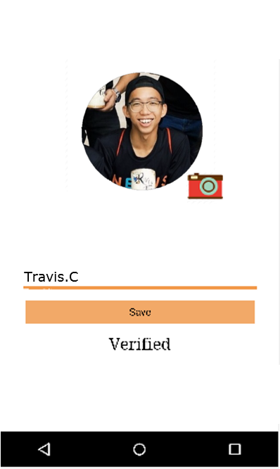

# NUSAnswers
**Group Name :** Zasian Top

**Group Members :** Travis Ching Jia Yea, Zhou Zegang

**Introduction**

One of the most effective ways to prepare for examination is by practicing past-year papers, and this practice is highly observed amongst NUS students. However, the University does not mandate the provision of answers for said papers. Many students thus are uncertain whether they have done the papers correctly even after spending hours attempting them. Current alternatives are friends, seniors and the IVLE forum. Yet friends and seniors don’t always know the answers and IVLE forum can be too slow a medium. The question is also too module-specific for Google to help out.

This may be detrimental as they may replicate the same mistakes during the actual exam if they are not rectified promptly. As such, in order to help NUS students with their revision and learning, we are going to launch an app called NUSAnswers which aims to solve this problem.

### Mission

We hope to create an App where NUS students can look up on answers for past year papers and engage in peer discussions efficiently.

### Vision

We want to promote peer learning among students and inspire them to embrace collaborative teamwork that is very important in the real world. At the same time, we wish to boost students’ confidence in themselves through incentivization and encourage them to have better self-evaluation skills as they give each other feedbacks.

### User Stories

**As a student…**

- As a NUS student, I want to have an organised and centralised database for me to look up on past-year paper answers so that it saves my time for checking answers .

- As a NUS student, I want to compare my answers for questions that I am uncertain with my peers so that I can confirm whether I have understood the concepts correctly. 

- As a NUS student, I want to acquire information that is as accurate as possible since I need to retrieve the right information for my queries.

- As a NUS student,I want to be notified when the information that I seek is updated so that I can always stay informed.

**As a member from school management level…**

- As a member from school management level, I want any platform that accesses school resources and students’ intellectual ideas to be able to ensure its confidentiality will not be compromised.

- As a member from school management level who wants NUS students to develop their own self-driven learning skills, I do not want platforms to pamper the students with other people's hard work such that they become freeloaders.

### Program Flow

### Milestone I
**Deliverables:**
- Poster: 
- Video Log: [click on link](https://youtu.be/S2Dd-nVHl9s)
- Project Log: [click on link](https://docs.google.com/document/d/1jkPjgnr9hjIxOyzJAKawiwtaW8GQhkuKoHvj5x4Imf4/edit?usp=sharing)

### Milestone II
**Deliverables:**
- Poster: 
- Video Log: [click on link](https://youtu.be/QQ6QXoeNh3g)
- Project Log: [click on link](https://drive.google.com/open?id=1vSMhWvJp9Y3XXb0L-UERXVajcoDe-Q3kpm3Gor1yyJU)

By end of Milestone II, we have came up with a minimum viable product for NUSAnswers.

Currently, we have finished implementing several necessary functions of our App. Firstly, we have completed user sign-up and log-in functionalities authenticated by Google Firebase. Secondly, we have designed a customized profile page such that users can upload their own profile pictures and create their unique usernames in our app. All these information will be stored in Google firebase storage and real-time database. In addition, we have implemented a navigation drawer for users to edit their profile, view their bookmarks, view the ‘about’ of our app as well as provide the logout functionality. Last but not the least, we have created the Q&A functionality so that users can post a question or provide their answers in our app.

For Milestone 3, we will be adding more features to our App to better meet the needs of our target users. Next, we will implement notification, upvote/flag and credit systems to complete the proposed features for NUSAnswers. Moreover, we will touch up the user interface design of our App to make it more appealing and user-friendly.

**App UI**

Infographic:

_Login Activty_

_Sign up Activity I_

Users can register their account with their own email. This is authenticated by google firebase.

_Sign up Activity II_

Users can choose their own profile image and display name. Email verification function is enabled to ensure only valid emails can register.

_Home Activity_

Users will transition through the different activities via this home page.

_Submitting an answer_

User submitted answers will be stored in Firebase’s database. Image attachment is supported for user’s convenience.

_Ask a question_

 

Each question submitted by users will be sorted according to filters such as module and year. A warning will be generated if question title has similar matches in our database. For objective questions, a poll must be created whereas it isn’t necessary for structured questions.
